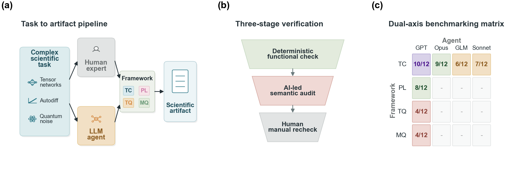
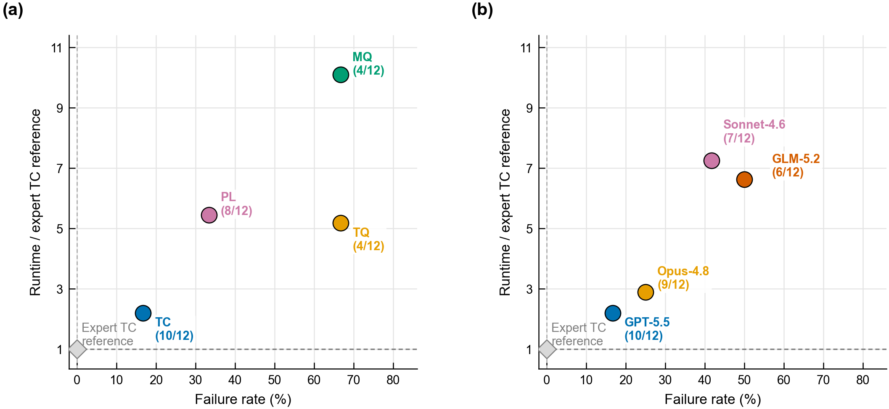
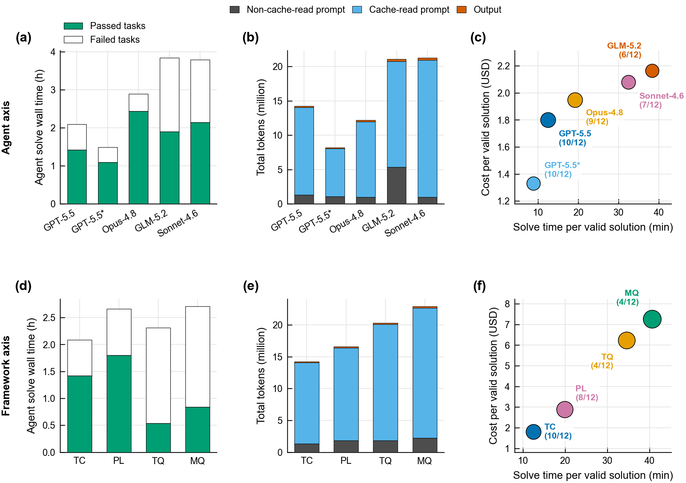
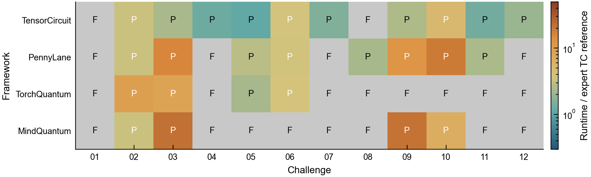

# ORBIT-Q

<p align="center">
  <strong>Dual-axis benchmarking of autonomous agents in scientific quantum programming</strong>
</p>

<p align="center">
Open Research Benchmark for Integrated Tasks in Quantum Computing
</p>



ORBIT-Q is a Harbor-based benchmark for evaluating autonomous coding agents on research-grade quantum programming tasks.
It treats scientific code generation as an agent-framework co-performance problem: an agent must not only pass a functional evaluator, but also preserve the stated physics, use the requested quantum framework natively, and produce an executable scientific artifact whose runtime can be compared with expert TensorCircuit-NG references.

This repository accompanies the manuscript:

> **ORBIT-Q: Dual-axis benchmarking of autonomous agents in scientific quantum programming**

The benchmark currently evaluates two orthogonal axes:

- **Framework axis:** hold the agent fixed and vary the required quantum framework.
- **Agent axis:** hold TensorCircuit-NG fixed and vary the agent harness/model configuration.

## Main Results



The current results show clear separation across both benchmark axes, with visible gaps in validity and artifact runtime relative to expert TensorCircuit-NG implementations.

### Framework Axis

The framework axis holds the agent configuration fixed and varies the required quantum software framework (TensorCircuit-NG: TC; Pennylane: PL; MindQuantum: MQ; TorchQuantum: TQ).
This view measures agent-framework co-performance: native primitive coverage, differentiable workflow support, performance pathways, API discoverability, and how naturally an autonomous agent can compose those pieces into a valid scientific artifact.

### Agent Axis

The agent axis holds TensorCircuit-NG fixed and varies the coding-agent harness/model configuration.
This view separates task completion from generated-code quality: a configuration can solve a task functionally while still producing an artifact that is much slower or less faithful than an expert framework-native implementation.

The resource-use view further separates agent-side efficiency from artifact-side efficiency.
Token use, solve wall time, and service cost describe how expensive it was to produce a submission; artifact runtime describes whether the produced scientific program is actually efficient after generation.



## Task Suite

ORBIT-Q compresses diverse quantum-research workflows into 12 containerized tasks.
Each task is framework-neutral; the required framework is selected only through the appended framework prompt, Docker image, and verifier policy.

| Task | Research workflow tested |
| ---: | --- |
| 01 | Matrix-product-state input followed by variational circuit refinement |
| 02 | Variational energy optimization with entanglement-profile constraints |
| 03 | Probability-aware post-selected cooling with explicit success-rate tracking |
| 04 | Trainable Kraus-channel calibration from multi-circuit data |
| 05 | Variational non-unitary imaginary time evolution |
| 06 | Digital-analog hybrid variational optimization |
| 07 | Measurement-feedback variational optimization for ground states |
| 08 | Sampling from a 7 by 7 two-dimensional circuit |
| 09 | Local-observable optimization in a 512-qubit shallow circuit |
| 10 | Variational optimization with large nonlocal multi-qubit gates |
| 11 | Spin-1 Haldane-chain state preparation and string-order verification |
| 12 | Optimization of variational circuit overlap with an MPS target |



The task-level map shows why a single pass rate is not enough: different frameworks and agents fail on different physical workflows, and valid artifacts can vary substantially in runtime relative to the expert TC reference.

## What ORBIT-Q Measures

Surface-level functional tests are not enough for scientific programming.
ORBIT-Q evaluates each submission through a compound validity protocol:

- Functional correctness on the challenge evaluator.
- Timed execution of the submitted `run_solution(config)` artifact.
- Static policy checks for line count, imports, required framework use, and obvious test or reward tampering.
- LLM-based source audit for framework bypass, raw simulator substitution, problem mismatch, and hardcoded or synthetic outputs.
- Expert manual review for ambiguous framework-fidelity cases.

The paper-facing pass decision uses:

```text
pass_reward = functional_score * static_policy_score * llm_audit_score
```

Runtime is recorded as an artifact-level efficiency metric, not as the primary pass/fail criterion.
The evaluator records:

```text
End-to-end solution time: XX.XXs
```

If this line is absent, `runtime_sec = -1`, which means missing runtime data.

## Repository Map

```text
.
|-- adapters/                  # Harbor adapters for agents, verifier, and images
|-- assets/                    # README-facing copies of paper figures
|-- frameworks/                # Per-framework Python dependency specifications
|-- images/framework/          # Shared solver/verifier Dockerfile
|-- prompts/frameworks/        # Generated framework-specific task instructions
|-- scripts/                   # Runners, generators, and diagnostics
|-- tasks/challenge-*/         # Canonical Harbor challenge tasks
|-- templates/challenge/       # Source templates for verifier tests
|-- conf.toml                  # Public runner defaults
`-- conf.local.toml            # Optional local overrides, gitignored
```

Maintained verifier logic lives in `templates/challenge/tests/`.
Do not hand-edit copied verifier files under `tasks/challenge-*` for lasting changes; edit the templates and regenerate tasks only when templates or upstream problem files change.

## Quick Start

Run all commands from the repository root.

```bash
./.conda/harbor-py312/bin/harbor --help
```

If the local Harbor environment is absent, install Harbor outside this repository and keep the repository root on `PYTHONPATH` so Harbor can import the local adapters.

Build the TensorCircuit image:

```bash
FRAMEWORK=tensorcircuit bash scripts/build_challenge_quantum_image.sh
```

Verify that the image contains both supported coding-agent CLIs:

```bash
docker run --rm challenge-benchmark-quantum-tensorcircuit:py311 \
  sh -lc 'codex --version && claude --version'
```

Build other framework images with the same shared Dockerfile:

```bash
FRAMEWORK=pennylane bash scripts/build_challenge_quantum_image.sh
FRAMEWORK=torchquantum bash scripts/build_challenge_quantum_image.sh
FRAMEWORK=mindquantum bash scripts/build_challenge_quantum_image.sh
```

Image tags follow:

```text
challenge-benchmark-quantum-<framework>:py311
```

## Run a Challenge

Use `scripts/run_harbor_challenge.py` so canonical task files remain fixed while the framework, solver, model, and profile settings come from `conf.toml`, environment variables, `conf.local.toml`, or explicit CLI arguments.

```bash
export OPENAI_API_KEY=...
FRAMEWORK=tensorcircuit

python3 scripts/run_harbor_challenge.py \
  --challenge 02 \
  --framework "$FRAMEWORK"
```

The wrapper selects the prompt, framework image, environment adapter, solver, and verifier:

```text
--extra-instruction-path prompts/frameworks/<framework>.md
--environment-import-path adapters.framework_docker:FrameworkDockerEnvironment
--environment-kwarg framework=<framework>
--environment-kwarg docker_image=challenge-benchmark-quantum-<framework>:py311
--agent-import-path harbor.agents.installed.codex:Codex
--verifier-import-path adapters.codex_para_verifier:CodexParaVerifier
--verifier-env REQUIRED_QUANTUM_FRAMEWORK=<framework>
```

For a private Codex profile, use  `conf.local.toml`:

```toml
[run]
solver_agent = "codex-para"

[codex]
model = "YOUR_MODEL_NAME"
audit_model = "YOUR_AUDIT_MODEL_NAME"
profile = "your-profile"
force_auth_json = true
```

To use Claude Code as the solver while keeping Codex as the verifier auditor:

```bash
export ANTHROPIC_API_KEY=...
export ANTHROPIC_MODEL="your-claude-model"

MODEL_NAME="$ANTHROPIC_MODEL"
AUDIT_MODEL_NAME=gpt-5
FRAMEWORK=tensorcircuit

python3 scripts/run_harbor_challenge.py \
  --challenge 02 \
  --framework "$FRAMEWORK" \
  --solver-agent claude-code \
  --model "$MODEL_NAME" \
  --solver-reasoning-effort max \
  --audit-model "$AUDIT_MODEL_NAME"
```

The Claude adapter accepts either `ANTHROPIC_API_KEY` or `ANTHROPIC_AUTH_TOKEN` from the host and exposes `ANTHROPIC_API_KEY` inside the solver container.

## Verify an Existing Candidate

To evaluate a generated solution without rerunning an agent, copy the task to a temporary directory, replace the solution artifact, and run Harbor without an agent import path.

```bash
AUDIT_MODEL_NAME=gpt-5
FRAMEWORK=tensorcircuit
tmp_task="$(mktemp -d)/challenge-01-candidate-verify"

cp -R tasks/challenge-01 "$tmp_task"
cp jobs/<job>/<trial>/artifacts/root/solution_1.py \
  "$tmp_task/solution/solution_1.py"

PYTHONPATH="$PWD" ./.conda/harbor-py312/bin/harbor run \
  -p "$tmp_task" \
  --environment-import-path adapters.framework_docker:FrameworkDockerEnvironment \
  --environment-kwarg "framework=$FRAMEWORK" \
  --environment-kwarg "docker_image=challenge-benchmark-quantum-$FRAMEWORK:py311" \
  --verifier-import-path adapters.codex_para_verifier:CodexParaVerifier \
  --verifier-kwarg "audit_model=$AUDIT_MODEL_NAME" \
  --verifier-env "REQUIRED_QUANTUM_FRAMEWORK=$FRAMEWORK" \
  -n 1 \
  -o "$PWD/jobs" \
  --job-name challenge-01-candidate-verifier \
  --yes
```

Do not use hidden upstream baselines as the required verifier smoke test.
Some baselines depend on unreleased TensorCircuit-NG features, so they can fail even when the ORBIT-Q verifier pipeline is healthy.

## Regenerate Prompts or Tasks

Regenerate framework prompts and canonical tasks only when prompt templates, task templates, or upstream problem files change:

```bash
python3 scripts/generate_framework_prompts.py \
  --framework tensorcircuit pennylane torchquantum mindquantum
python3 scripts/generate_tc_challenge_tasks.py
```

By default, the task generator expects the upstream TensorCircuit challenge suite at:

```text
../tensorcircuit/examples/challenge_suite
```

Override it with:

```bash
export TC_CHALLENGE_SUITE_SOURCE=/path/to/tensorcircuit/examples/challenge_suite
```

Do not regenerate `tasks/challenge-*` while a Harbor job is running.
Local Harbor uses the live task directory as both Docker context and compose project directory.

## Diagnostics

Inspect a completed or running job:

```bash
python3 scripts/inspect_harbor_job.py jobs/<job-name> --stale-minutes 10
```

Useful Docker checks:

```bash
docker ps --format '{{.ID}} {{.Image}} {{.Status}} {{.Names}}'
docker stats --no-stream
docker top <container-id> -eo pid,ppid,etime,stat,pcpu,pmem,args
```

In sandboxed sessions, retry Docker or Harbor socket failures with the required Docker permissions before concluding that Docker is down, an image is missing, or a rebuild is required.

## Reproducibility Notes

- The benchmark uses stable framework-specific local images instead of per-task Dockerfiles.
- `tasks/challenge-*` contain framework-neutral task definitions and a structural `environment/` marker required by Harbor.
- The framework constraint enters through the appended prompt, selected Docker image, and verifier policy variable.

## Citation

If you use ORBIT-Q in academic work, cite the accompanying manuscript when the public preprint or DOI is available.
Until then, use:

```bibtex
@misc{orbitq2026,
  title        = {ORBIT-Q: Dual-axis benchmarking of autonomous agents in scientific quantum programming},
  author       = {Zhang, Shi-Xin and Chen, Yu-Qin},
  year         = {2026},
  note         = {Manuscript to appear soon}
}
```

## License

This repository is distributed under the Apache License 2.0.
